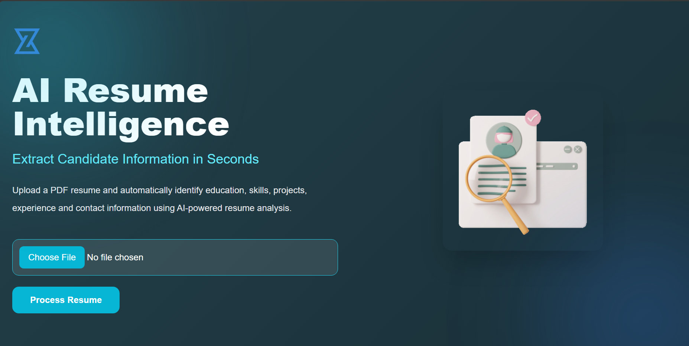
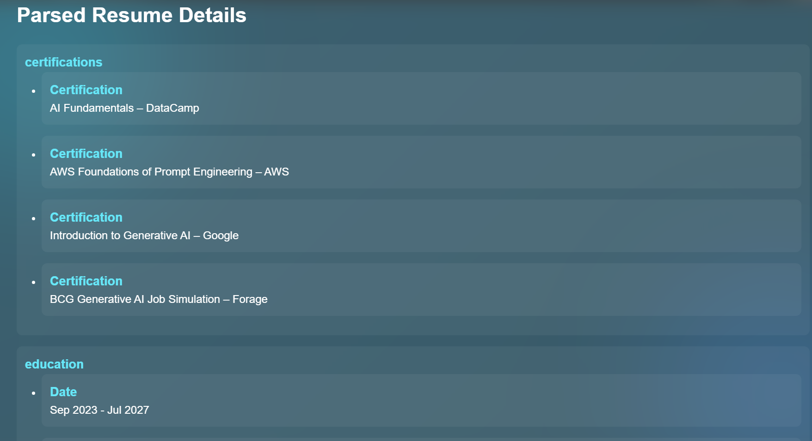
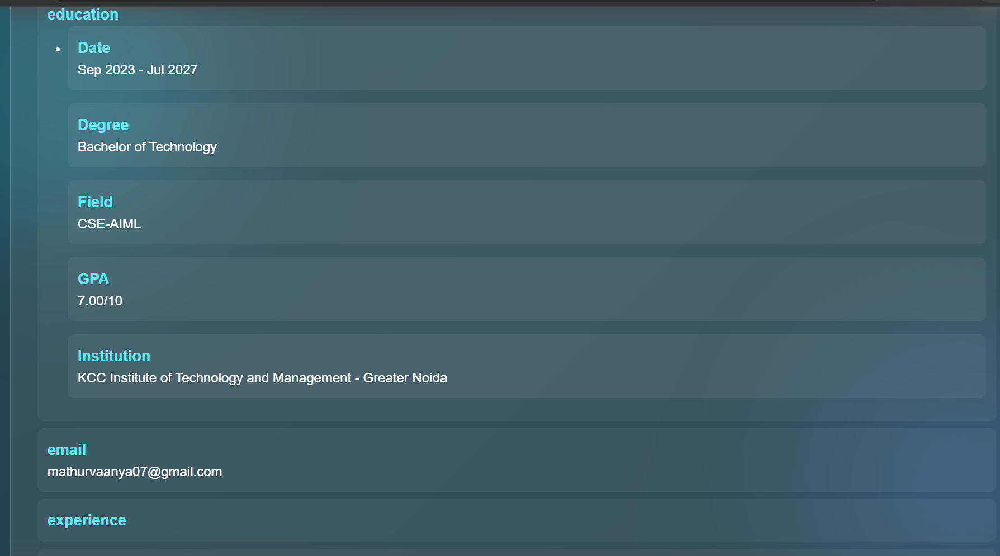

# 🤖 AI Resume Parser

An AI-powered resume parsing application that automatically extracts and structures important information from PDF resumes using **Large Language Models (LLMs)**.

The application combines **PDF text extraction** with **Llama 3.2**, running locally through **Ollama**, to convert unstructured resume content into structured and readable information. Since the LLM runs locally, the application is privacy-friendly and does not require external APIs or cloud services.

---

## 📖 Overview

Recruiters often spend significant time manually reviewing resumes and extracting relevant candidate information.

This project automates the resume screening process by:

* Extracting text from PDF resumes
* Processing unstructured resume content using an LLM
* Converting the extracted information into structured data
* Displaying the results through a simple web interface

The entire application runs locally using **Ollama and Llama 3.2**, ensuring that sensitive resume data remains on the user's machine.

---

## ✨ Features

* 📄 Upload resumes in PDF format
* 🔍 Automatic text extraction using `pypdf`
* 🤖 AI-powered information extraction using **Llama 3.2**
* 🧠 Local LLM inference using **Ollama**
* 📋 Extracts structured information including:

  * Name
  * Email
  * Phone Number
  * Skills
  * Education
  * Experience
  * Projects
  * Certifications
* 🌐 Dynamic result rendering using **Jinja2 templates**
* 🔒 Fully offline and privacy-friendly
* ⚡ Lightweight **FastAPI** backend
* 🎨 Simple and responsive user interface

---

## 🛠 Tech Stack

### Backend

* Python
* FastAPI
* Uvicorn

### AI & NLP

* Ollama
* Llama 3.2

### PDF Processing

* pypdf

### Frontend

* HTML
* Tailwind CSS
* JavaScript
* Jinja2

---

## 📁 Project Structure

```text
AI-Resume-Parser/
│
├── templates/
│   └── index.html
│
├── images/
│   ├── homepage.png
│   ├── upload.png
│   ├── output1.png
│   └── output2.png
│
├── __DATA__/
│   └── .gitkeep
│
├── app.py
├── resumeparser.py
├── requirements.txt
├── README.md
├── .gitignore
```

---

## ⚙️ Installation

### 1. Clone the Repository

---

### 2. Install Dependencies

Install the required Python packages:

```bash
pip install -r requirements.txt
```

---

### 3. Install Ollama

Download and install Ollama from the official website:

[Download Ollama](https://ollama.com?utm_source=chatgpt.com)

---

### 4. Pull the Llama 3.2 Model

Download the required LLM using:

```bash
ollama pull llama3.2
```

---

### 5. Start Ollama

Start the Ollama service:

```bash
ollama serve
```

Keep this terminal running while using the application.

---

### 6. Run the Application

Start the FastAPI application using:

```bash
python app.py
```

Or run it directly using Uvicorn:

```bash
uvicorn app:app --reload
```

---

### 7. Open the Application

Open your browser and navigate to:

```text
http://127.0.0.1:8000
```

---

## 🔄 Application Workflow

The application follows the following workflow:

```text
Upload PDF Resume
        ↓
Extract Text using pypdf
        ↓
Send Resume Text to Llama 3.2
        ↓
Process using Ollama Locally
        ↓
Generate Structured JSON Output
        ↓
Display Results using Jinja2
```

### Step-by-Step Process

1. 📄 The user uploads a resume in PDF format.
2. 🔍 The application extracts text from the PDF using `pypdf`.
3. 🤖 The extracted resume text is sent to **Llama 3.2** through **Ollama**.
4. 🧠 The LLM analyzes the unstructured resume content.
5. 📋 Relevant candidate information is converted into structured JSON data.
6. 🌐 The extracted information is dynamically displayed on the webpage.

---

## 📸 Project Preview

### 🏠 Homepage



### 📤 Upload Resume


### 📄 Parsed Output



### 📋 Structured Result



---

## 🚀 Future Improvements

* 🎯 Resume-to-Job Description Matching
* 📊 ATS Compatibility Score
* 📄 Support for DOCX Resumes
* 📥 Export Results as CSV or JSON
* 🔐 User Authentication
* ☁️ Cloud Deployment
* 🤖 Support for Multiple LLMs

  * OpenAI
  * Google Gemini
  * Anthropic Claude
* 📈 Candidate Ranking and Comparison
* 🔎 Automated Resume Screening
* 📝 Job Description Analysis

---

## 🔒 Privacy

One of the key features of this project is its **local AI processing architecture**.

Resume data is processed locally using **Ollama and Llama 3.2**, meaning sensitive candidate information does not need to be sent to external AI APIs or cloud-based services.

This makes the application suitable for experimenting with AI-powered resume processing while maintaining greater control over sensitive data.

---

## 🙏 Acknowledgements

* [Ollama](https://ollama.com)
* Meta Llama 3.2
* FastAPI
* pypdf
* Jinja2

---

## 👩‍💻 Author

**Vaanya Mathur**

B.Tech in Computer Science & Engineering (AI & ML)
